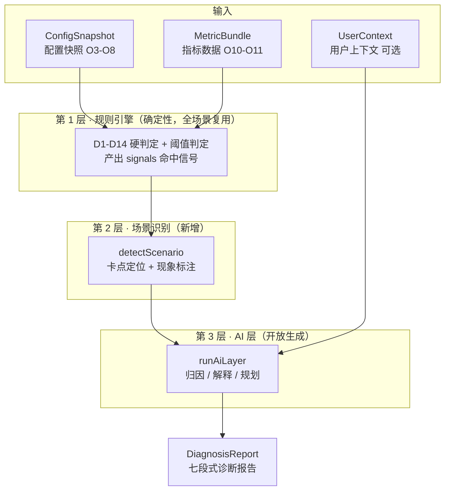
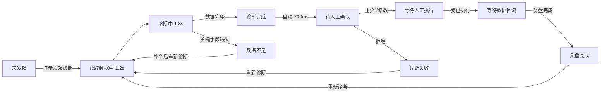
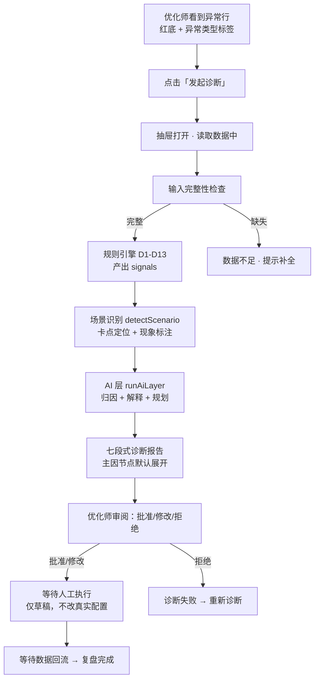
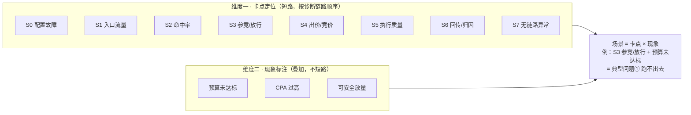
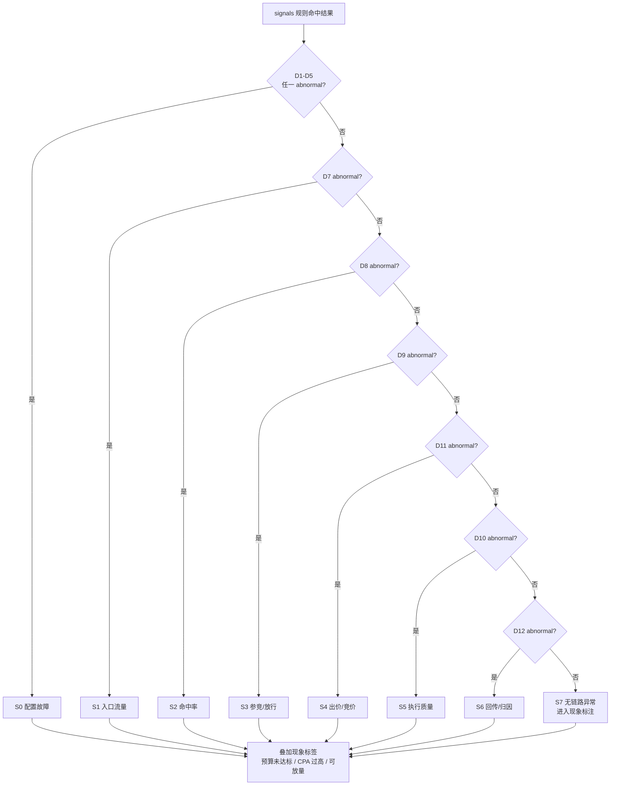

# 项目三：RTA 投放诊断 Agent · PRD v0.2.1

> 文档状态：v0.2.1（场景识别完成 + CPA 现象标签补全）
> 版本日期：2026-08-18
> 文档性质：作品集 PRD，基于《产品定义 v0.1》《RTA 对象模型与字段清单》《MVP 诊断规则表》《Agent 输入输出结构契约 v0.2》《AI 层设计与评测方案》《贴图与页面结构参考清单》《场景扩展方案》及 demo/v3.1 实现逆向整理。
> 关联文档：上述 7 份 + 《项目三框架定义》《项目三启动与输入清单》《项目三资料盘点与可用性分析》《RTA 典型问题案例采集草稿》。

---

## 0. 版本变更记录

### v0.1 → v0.2

| 变更 | 说明 |
| --- | --- |
| 产品目标多场景化 | 从"单一场景（跑不出去）"扩展为"多场景诊断" |
| 新增 §8 诊断场景体系 | 场景识别模型（卡点定位 × 现象标注）、8 场景 S0-S7、判定树流程图 |
| 分工改为三层 | 规则引擎 → 场景识别 → AI 层（原两层） |
| 核心流程插入场景识别 | 诊断流程增加 detectScenario 步骤 |
| 列表页增加异常类型 | 异常状态列扩展为场景标签 |
| 后续规划更新 | 场景扩展从 V0.3 移至本期进行中 |
| 新增流程图/思维导图 | §4.4 架构总览图 + §8.3 场景判定决策树 |

### v0.2 → v0.2.1

| 变更 | 说明 |
| --- | --- |
| 场景识别状态更新 | v3.1 场景识别层已由 WorkBuddy 落地并通过（S0-S7 + 现象标签 + 列表异常类型 + 抽屉场景 badge） |
| 新增 D14 CPA 判定 | 「CPA 过高」现象标签的判定规则落地（不进 S0-S7 短路链，只服务现象标注） |
| CPA 字段补齐规划 | Golden Case 及列表 mock 补充 conversionCount / actualCpa / targetCpa 字段 |
| 现象标签三标签齐备 | 预算未达标 / CPA 过高 / 可安全放量（v3.2 实施） |
| Demo 版本线澄清 | 明确 v3.x（贴母版功能线）与 v4/v5（离线化线）双线并存 |
| 遗留事项更新 | CPA 字段缺口转为"v3.2 实施中"；场景叙事补全推进 |

---

## 1. 背景与目标

### 1.1 背景

广告主侧负责 RTA 投放和策略运营的业务人员（下称"优化师"），在遇到投放异常（跑不出去、CPA 过高、命中率下降等）时，需要在 RTAID 配置 → 账户绑定 → 策略工厂 → RTA 实验 → QPS → 报表 → 执行日志 → 归因回传多个页面间人工排查，难以快速判断：

- 异常发生在哪一层；
- 哪些证据支持这个判断；
- 哪些配置需要优先检查；
- 下一步应该调整什么；
- 如何低风险验证判断是否正确。

### 1.2 产品目标

构建嵌入投放平台的 **RTA 投放诊断 Agent**：自动读取 RTAID、策略、实验、QPS、报表、执行日志等多源信号，**识别当前属于哪类异常场景**，定位根因，生成带观察指标、成功标准和回滚条件的实验方案，由优化师人工确认后执行。

**产品定位（一句话）**：

> 面向 RTA 投放优化的受控 Agentic Workflow，在提升诊断效率的同时保留广告投放的人工风控边界。

**非目标**：不建设真实 RTA 接口、不对接真实媒体 API、不自动修改真实预算/出价/策略、不做完整归因系统。

### 1.3 成功指标（作品集层面）

| 维度 | 指标 |
| --- | --- |
| 诊断效率 | 优化师定位根因的页面跳转数从 7+ 页降到 1 个抽屉内完成 |
| 诊断覆盖 | 从单一场景扩展到多场景识别（卡点定位 × 现象标注） |
| AI 价值 | 规则引擎判定 + 场景识别 + AI 归因/解释/规划的分工可被清晰解释 |

---

## 2. 用户与角色

| 角色 | 说明 | 权限边界 |
| --- | --- | --- |
| 投放优化师（首要用户） | 广告主侧 RTA 投放/策略运营业务人员 | 发起诊断、查看诊断结果、确认/修改/拒绝方案、执行配置变更 |
| 管理者/老板 | 查看管理摘要，判断问题与影响 | 只读，默认只看管理摘要层 |
| 技术人员 | 核验技术证据、追溯原始数据 | 只读，可展开技术证据层 |

**权限原则**：AI 只读数据和生成草稿；所有配置变更必须人工审批后执行；技术证据默认折叠，按需披露。

---

## 3. 范围

### 3.1 本期纳入（MVP）

- 多场景诊断（卡点定位 + 现象标注，见 §8）
- RTAID/QPS/媒体账户配置检查（D1-D3）
- 策略工厂配置检查（D4）
- RTA 实验状态与分桶检查（D5-D6）
- 执行日志异常解释（D10）
- 请求/命中/参竞链路检查（D7-D9）
- 出价配置检查（D11）
- 归因与回传作为"效果可信度检查"（D12）
- 预算达成率检查（D13，现象维度）
- CPA 达标判定（D14，现象维度，不进 S0-S7 短路链）
- 场景识别（detectScenario：8 场景 S0-S7）
- 现象标签（预算未达标 / CPA 过高 / 可安全放量）
- AI 原因排序（primary/secondary/excluded）
- AI 生成实验方案（含观察指标、成功标准、回滚条件）
- 人工确认后的实验草稿
- 10 状态机完整流转

### 3.2 本期不纳入

- 建设真实 RTA 接口 / 对接真实媒体 API
- 自动修改真实预算、出价或策略
- 完整归因系统与回传 API 管理
- 多媒体全部能力矩阵
- Apple Ads 独立归因场景
- 实时消耗率监控（默认按自然日判断）

---

## 4. 产品形态与信息架构

### 4.1 产品形态

**投放管理列表页 + 右侧 RTA 诊断抽屉**（720px）。

- 入口：投放管理 > RTA > RTAID 配置 列表页，行级「发起诊断」按钮
- 展示：右侧滑入诊断抽屉，左侧列表保持可见
- 独立诊断工作台为后续扩展项

### 4.2 信息架构

```
投放平台
└── 投放管理
    └── RTA
        ├── RTAID 配置（当前：诊断入口所在列表页）
        │   ├── 顶部 QPS 提示条 + 3 张 QPS 概览卡
        │   ├── 筛选区（RTAID 搜索 / 媒体 / 状态）
        │   ├── RTAID 列表（含 Portfolio 扩展列：项目/预算/消耗/达成率/异常类型）
        │   └── 行级操作：查看 / 编辑 / 发起诊断
        ├── 策略工厂
        ├── RTA 实验
        └── 数据中心（RTA 报表 / 执行日志）
```

### 4.3 关键设计决策

1. **不新增独立菜单项**：诊断入口做成列表行级「发起诊断」按钮，长在真实 RTAID 配置页内，而非另起后台。
2. **列表字段双来源**：核心 8 列来自真实截图（媒体/RTAID/BidURL/账户/状态/QPS/绑定账号数/关联实验数），4 列 Portfolio 扩展（项目名/日预算/实际消耗/预算达成率/异常类型）。
3. **指标卡贴真实口径**：顶部 3 张 QPS 卡（总配置/已占用/剩余）+ tip 蓝条，不造营销指标卡。

### 4.4 架构总览图（诊断 Agent 分层）



> 核心思想：**规则引擎是全链路体检，场景只是体检报告的不同解读方式。** 扩展新场景不改引擎，只加"场景识别 + 场景叙事"。

---

## 5. 页面结构与功能

### 5.1 列表页（母版 A）

| 区域 | 内容 |
| --- | --- |
| 顶部导航 | GROWTHPLATFORM 平台导航（沿用平台壳） |
| 左侧导航 | 投放管理 > RTA（RTAID 配置为当前项） |
| QPS tip 蓝条 | 系统 QPS 上限 / 已分配 / 剩余 / 整体使用率 |
| QPS 概览卡 | 总配置 QPS / 总实验已占用 QPS / 总剩余 QPS（3 张） |
| 筛选区 | RTAID 搜索、媒体下拉、状态下拉 |
| 列表 | 核心 8 列 + Portfolio 4 列；异常行红底 + 红色消耗/达成率/进度条 |
| 异常类型列 | 展示场景标签（预算未达标 / CPA 过高 / 命中率下降 / 配置故障…） |
| 行级操作 | 查看 / 编辑 / 「发起诊断」（异常行蓝主按钮） |
| 底部说明 | Agent 边界声明（AI 只诊断不修改配置） |

### 5.2 诊断抽屉（母版 B）

**顶部元信息**：媒体 / 账户 / 项目 / RTAID / 诊断日期 / 状态徽标 / 关闭按钮。

**Agent 七段式输出**：

| # | 区块 | 内容 | 默认状态 |
| --- | --- | --- | --- |
| 00 | 诊断场景 | 场景名称（如"参竞/放行异常"）+ 现象标签 | 展开 |
| 01 | 诊断结论 | oneLiner（因果链）+ 管理摘要 + 运营解释 | 展开 |
| 02 | 影响概览 | 日预算/消耗/缺口/达成率 + 影响范围 + extraMetrics + 资源口径指标 | 展开 |
| 03 | 原因排序 | 主因/次因/已排除 + 置信度 + 影响程度 | 展开 |
| 04 | 证据时间线 | 配置变更、指标变化、曝光消耗变化 | 可折叠 |
| 05 | 原因树 | 8 类节点（budget/binding/traffic/service/experiment/strategy/bidding/attribution），主因节点默认展开 | 展开 |
| 06 | 建议方案 | action/before/after/impact/观察指标/成功标准/回滚条件 | 展开 |
| 07 | 人工确认 + 技术详情 | RTAID/实验ID/分组/分桶/请求ID/日志路径/configBefore/After/数据来源 | 折叠 |

**底部操作区**：修改方案（白）/ 拒绝（红）/ 批准方案（蓝主按钮）。

---

## 6. 状态机

### 6.1 状态定义（10 状态）

| # | 状态 | 说明 |
| --- | --- | --- |
| 1 | 未发起 | 初始状态，列表可见 |
| 2 | 读取数据中 | 系统读取 ConfigSnapshot + MetricBundle（约 1.2s） |
| 3 | 诊断中 | 规则引擎 D1-D13 + 场景识别 + AI 层（约 1.8s） |
| 4 | 诊断完成 | 展示七段式诊断结果 |
| 5 | 数据不足 | 关键字段缺失，提示补全后重新诊断 |
| 6 | 待人工确认 | 展示批准/修改/拒绝按钮（诊断完成后 700ms 自动进入） |
| 7 | 等待人工执行 | 方案已确认，等待人工执行配置变更 |
| 8 | 等待数据回流 | 执行后等待数据回流（通常 24h） |
| 9 | 复盘完成 | 展示复盘结果，可归档/重新诊断 |
| 10 | 诊断失败 | 方案被拒绝或信号冲突，可重新诊断 |

### 6.2 状态流转



### 6.3 数据不足触发条件

当出现以下任一情况时进入「数据不足」：
- ConfigSnapshot 缺失 rtaid / experiment / groups
- MetricBundle 缺失 coreMetrics / usageMetrics / budget
- totalRequests 为 0

原则：**数据不足时不强行诊断、不编造指标值**（对齐契约 v0.2 §2.4）。

---

## 7. 核心流程（端到端）



---

## 8. 诊断场景体系（多场景识别）

### 8.1 场景识别模型：卡点定位 × 现象标注

场景不是独立的引擎，而是两个维度的组合：



### 8.2 场景定义（8 场景 + 现象标签）

**主判定（卡点定位，短路）**：

| 场景 ID | 卡点 | 主判据（abnormal 信号） | 前提（上游须 normal） | 对应典型问题 |
| --- | --- | --- | --- | --- |
| S0 | 配置故障 | D1/D2/D3/D4/D5 任一 | —（最高优先级） | 前置 |
| S1 | 入口流量 | D7（请求量环比降 >50%） | — | ① 子类型 |
| S2 | 命中率 | D8（命中率 <50%） | D7 normal | ③ |
| S3 | 参竞/放行 | D9（参竞率差 >20pp） | D7/D8 normal | ① 核心 + ④ |
| S4 | 出价/竞价 | D11（出价越界） | 上游 normal | ④ |
| S5 | 执行质量 | D10（超时/失败/P99） | 上游 normal | 服务异常 |
| S6 | 回传/归因 | D12（回传成功率 <95%） | 上游 normal | ⑤ |
| S7 | 无链路异常 | 全 normal | — | 现象层 |

**辅标注（现象标签，叠加）**：

| 标签 | 判定 | 状态 |
| --- | --- | --- |
| 预算未达标 | 达成率 < 60% | ✅ v3.1 已实现 |
| CPA 过高 | actualCpa > targetCpa（D14：actualCpa > targetCpa × 1.2 判 abnormal） | 🚧 v3.2 实施中 |
| 可安全放量 | 达成率 ≥ 90% 且 CPA 达标 | 🚧 v3.2 实施中 |

> D14 说明：CPA 是**现象维度**（"钱花出去了但贵"），不是链路卡点，因此**不进 detectScenario 的 S0-S7 短路判定**，只服务现象标签与列表页展示。Golden Case 的 actualCpa 应 ≤ targetCpa，确保不触发「CPA 过高」、不污染主判定（主因 D9）。

**6 个典型问题映射**：

| 典型问题 | 场景组合 |
| --- | --- |
| ① 有预算但跑不出去 | S1/S2/S3/S4/S6 +「预算未达标」 |
| ② 能消耗但 CPA 过高 | 「CPA 过高」标签（常叠加 S4/S6） |
| ③ 请求正常但命中率下降 | S2（+ 预算未达标，若消耗也降） |
| ④ 命中正常但竞价失败 | S3/S4 |
| ⑤ 前链路正常但 CVR 下降 | S6（+ CPA 过高） |
| ⑥ 成本稳定后安全放量 | S7 +「可安全放量」 |

### 8.3 场景判定决策树（detectScenario 短路逻辑）



### 8.4 各场景叙事要点

| 场景 | oneLiner 方向 | 建议方向 |
| --- | --- | --- |
| S0 配置故障 | "RTAID 未上线/账户未绑定/…，链路未生效" | 先修配置，不进实验建议 |
| S1 入口流量 | "请求量环比下降，问题在媒体侧流量/创意/计划" | 不调 RTA 策略，排查媒体侧 |
| S2 命中率 | "命中率下降，人群包/模型阈值/字段匹配异常" | 回滚规则 / 扩人群 / 放宽字段 |
| S3 参竞/放行 | "策略门槛过严 → 参竞率降 → 消耗不足"（当前 Golden Case） | 门槛回调小流量试跑 |
| S4 出价/竞价 | "出价竞争力不足 → 竞价失败" | 提价实验 + 止损上限 |
| S5 执行质量 | "超时/失败率异常 → 服务/容量问题" | 优先排障，不调策略 |
| S6 回传/归因 | "回传异常 → 效果判断可能失真" | 提示"别调 RTA"，先修回传 |
| S7 无异常 | 依现象标签：未达标=深查；CPA 高=收人群；可放量=分层加预算 | 依现象标签 |

---

## 9. 规则引擎、场景识别与 AI 层分工（三层）

| 层 | 职责 | 输出 | 不做什么 |
| --- | --- | --- | --- |
| 规则引擎 | D1-D13 硬判定、阈值判定、证据收集 | signals 信号、causeTree、timeline、impact 数值、technical | 不做归因、不写自然语言、不生成方案 |
| 场景识别 | 按规则命中组合判断场景归属、标注业务现象 | sceneId、phenomenonTags、confidence | 不改判定结果、不生成文案 |
| AI 层 | 归因排序、因果链、分角色解释、实验方案生成 | oneLiner / managerSummary / causes / recommendations | 不计算指标、不伪造证据、不改变判定结果 |

**关键边界**：
1. 场景识别和 AI 层都只消费规则引擎的结构化输出（signals + config + metrics），不自己算指标、不查数。
2. AI 层接口形状对齐《AI 层设计与评测方案》§3/§4，Mock 阶段模板占位、后续无痛替换为真实 LLM。
3. **扩展新场景不改规则引擎**，只改场景识别（加判定分支）+ AI 层（加叙事模板）。

---

## 10. 数据策略

- 全量 Mock 数据（巨量单一媒体：1 账户 / 1 项目 / 2 单元 / 2 创意 / 1 RTAID / 1 实验 / 对照+实验组 / 2 策略）。
- 展示数据标注为模拟数据；真实截图仅内部设计参考。
- 不确定的媒体侧字段保留原名并标注【待核验】。
- Golden Case：夏季大促 P-2026-SUMMER，日预算 1000 / 消耗 300 / 达成率 30%；11:50 门槛 40%→80%，12:00 生效，参竞率 60%→10%；对照消耗 250 / 实验消耗 50。
- CPA 场景字段：`conversionCount`（转化数）/ `actualCpa`（= actualCost ÷ conversionCount）/ `targetCpa`（目标 CPA）——v3.2 补齐 mock 数据（Golden Case 与列表各条记录），供 D14 与现象标签使用。

---

## 11. 验收标准

### 11.1 分角色验收

| 角色 | 验收标准 |
| --- | --- |
| 管理者 | 30 秒内说清问题、影响和是否需要处理 |
| 运营人员 | 能复述主要原因，明确下一步操作及需观察的指标 |
| 技术人员 | 能从解释结果追溯到原始数据、配置和日志证据 |
| 目标用户（可用性） | 1 分钟内正确回答"发生了什么、为什么发生、接下来做什么"至少两问 |

### 11.2 功能验收（14 项）

| # | 验收项 | 判定 |
| --- | --- | --- |
| 1 | 列表页像真实投放平台（RTAID 配置 + 3 QPS 卡 + tip） | 视觉对照通过 |
| 2 | 诊断入口为列表行级按钮，无独立菜单项 | 结构检查 |
| 3 | 抽屉 720px 右侧滑入，左侧可见 | 交互检查 |
| 4 | 七段式输出完整 | 区块齐全 |
| 5 | 原因树 8 类节点 + 主因节点默认展开 | 交互检查 |
| 6 | 技术详情默认折叠 | 交互检查 |
| 7 | Golden Case 主因命中（门槛变更→参竞率降） | 评测 L2 |
| 8 | 建议方案 before/after 正确（80%→60%），无硬编码 | 代码检查 |
| 9 | 10 状态机全部可达（含数据不足、失败、重新诊断） | 遍历检查 |
| 10 | 数据不足不编造结果 | 评测检查 |
| 11 | Agent 边界声明（不自动改配置） | 文案检查 |
| 12 | 1440px 布局稳定，无重叠 | 视觉检查 |
| 13 | 场景识别 detectScenario 落地（8 场景 S0-S7） | 代码检查 |
| 14 | 列表页展示异常类型标签，Golden Case 判定结果不变 | 回归检查 |
| 15 | 现象标签三标签齐全（预算未达标/CPA 过高/可安全放量），列表与抽屉口径一致 | 代码 + 回归检查 |
| 16 | 字段缺失时（无 CPA 数据）优雅降级不报错 | 代码检查 |

### 11.3 AI 层评测（对齐《AI 层设计与评测方案》）

| 层级 | 标准 |
| --- | --- |
| L1 判定正确性 | D1-D13 判定 100% 一致（前置门槛） |
| L2 归因正确性（一票否决） | 主因命中 + 因果链方向正确 + 单主因时次因=无 |
| L3 解释质量 | 管理摘要三要素 + 分层 + 术语翻译 |
| L4 规划质量 | 动作命中 + 三要素齐全 + 可执行性 |

---

## 12. 边界与降级

| 场景 | 行为 |
| --- | --- |
| 数据不足 | 输出 insufficient 状态，提示补全，不编造 |
| 无异常信号 | 输出"未发现明确异常，请人工复核"（S7） |
| 置信度低 | 明确提示需人工核验（后续增强项） |
| 媒体侧字段不确定 | 保留 Mock 并标注【待核验】 |
| 场景识别歧义 | 多个卡点同时命中时，按链路短路顺序取最上游（如 D8 和 D9 同时命中 → 取 S2） |

---

## 13. 后续规划

| 迭代 | 内容 | 状态 |
| --- | --- | --- |
| V0.1 | 单场景 MVP（有预算跑不出去） | ✅ 已完成 |
| V0.1.5 | AI 层拆分 + 契约修正 | ✅ 已完成 |
| V0.2 | 场景识别 detectScenario + 多场景诊断（v3.1） | ✅ 已完成 |
| V0.2.5 | **CPA 现象标签补全**（D14 + conversionCount/actualCpa/targetCpa 字段 + 三标签渲染，v3.2） | 🚧 实施中（WorkBuddy） |
| V0.3 | AI 层接入真实 LLM；评测集扩展（多主因/排除项/回传异常） | ⏳ 待启动 |
| V0.4 | 场景叙事逐场景补全（S0-S2、S4-S7 的 oneLiner/建议模板）；相似案例检索、实验复盘自动沉淀 | ⏳ 待启动 |
| V0.5 | 离线化可运行版（v4/v5 线收口，解决本地双击打开） | ⏳ 待收口 |

---

## 14. 遗留事项

1. **Kiki 字段表核验**：巨量开放平台字段表截图 → 核验项目预算、RTA 策略生效范围、RTA 绑定关系、联合实验 T+1 报表请求/返回字段与指标口径（不阻塞 mock MVP，真实接入前必须完成）。
2. **贴图清单 20 张截图【待确认】**：需逐张确认对应页面后补进《贴图与页面结构参考清单》。
3. **契约字段同步**：契约 v0.2 新增字段（extraMetrics/children/rtaInternalId/budget 类）需随 AI 层拆分在代码中最终落地；D14 与 CPA 字段（conversionCount/actualCpa/targetCpa）落地后需同步契约（升 v0.3 或补录）。
4. **CPA 场景字段落地**（v3.2 实施中）：`conversionCount` / `actualCpa` / `targetCpa` 字段 + D14 规则落地后，Golden Case 与列表 mock 需补充数据，并确保 Golden Case 不触发「CPA 过高」（actualCpa ≤ targetCpa）。
5. **场景叙事补全**：当前 S3（参竞/放行）有完整叙事，S7 按现象标签分派；S0-S2、S4-S6 仍用通用 fallback，需逐场景补 oneLiner + 建议模板（V0.4）。
6. **离线化收口**：v4 内置浏览器已通过但本地双击仍白屏、v5 重建中——需在功能稳定后统一收口为"零外网依赖 + 普通 script"的可运行版（V0.5）。
