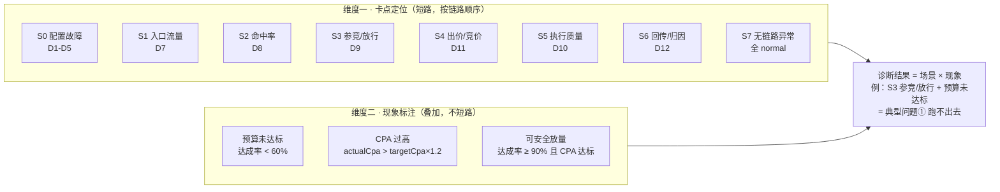

# 项目三：场景矩阵图（8 场景 × 3 标签 → 6 典型问题）

> 用途：作品集展示用的一图看懂"一个引擎如何诊断多种问题"。
> 三种呈现形式：mermaid（文档）、文本矩阵（表格）、讲解话术（面试）。

---

## 1. 核心模型：卡点定位 × 现象标注

---

## 2. 文本矩阵（表格版）

### 2.1 场景（卡点）维度

| 场景 | 卡点环节 | 主判据 | 对应典型问题 | 叙事深度（v6） |
|---|---|---|---|---|
| S0 | 配置故障 | D1-D5 任一 abnormal | 前置（非 6 类）| ✅ 完整 |
| S1 | 入口流量 | D7 请求量环比降 >50% | ① 跑不出去（子类型）| 🔄 补全中 |
| S2 | 命中率 | D8 命中率 <50% | ③ 请求正常但命中率下降 | 🔄 补全中 |
| S3 | 参竞/放行 | D9 参竞率差 >20pp | ① 核心 + ④ 子类型（Golden Case）| ✅ 完整 |
| S4 | 出价/竞价 | D11 出价系数越界/偏低 | ④ 命中正常但竞价失败 | 🔄 补全中 |
| S5 | 执行质量 | D10 超时/失败/P99 异常 | 服务异常（非 6 类）| 🔄 补全中 |
| S6 | 回传/归因 | D12 回传成功率 <95% | ⑤ 前链路正常但 CVR 下降 | 🔄 补全中 |
| S7 | 无链路异常 | 全 normal | 现象层（②/⑥ 在此）| ✅ 完整 |

### 2.2 现象（标签）维度

| 标签 | 判定 | 含义 |
|---|---|---|
| 预算未达标 | 达成率 <60% | 钱没花出去 |
| CPA 过高 | actualCpa > targetCpa × 1.2 | 钱花出去了但贵 |
| 可安全放量 | 达成率 ≥90% 且 CPA 达标 | 跑得好，可加预算 |

### 2.3 场景 × 现象 → 6 个典型问题

| 典型问题 | 场景组合 | 现象标签 |
|---|---|---|
| ① 有预算但跑不出去 | S1 / S2 / S3 / S4 / S6 | 预算未达标 |
| ② 能消耗但 CPA 过高 | S7（或 S4/S6 叠加）| CPA 过高 |
| ③ 请求正常但命中率下降 | S2 | 预算未达标（若消耗也降）|
| ④ 命中正常但竞价失败 | S3 / S4 | （视情况）|
| ⑤ 前链路正常但 CVR 下降 | S6 | CPA 过高 |
| ⑥ 成本稳定后安全放量 | S7 | 可安全放量 |

---

## 3. 讲解话术（30 秒版）

> "这个 Agent 不是 6 个独立引擎，而是'卡点定位 × 现象标注'两个维度的组合。规则引擎 D1-D14 做全链路体检，先按链路顺序短路判断卡点在哪一环（S0-S7），再叠加业务现象标签（预算未达标/CPA 过高/可安全放量）。一个诊断请求可以同时命中'卡点 = S3 参竞率'和'现象 = 预算未达标'，这就是典型问题①跑不出去。扩展新场景不改引擎，只加'场景识别分支 + 叙事模板'。"

---

## 4. 对应 Demo 中的 10 条 mock 展示

| RTAID | 场景 | 列表标签 |
|---|---|---|
| juliang-rta-2086 | S3 | 预算未达标 ⭐Golden |
| tencent-rta-3112 | S0 | CPA 过高 |
| huawei-rta-5040 | S7 | 可安全放量 |
| xiaomi-rta-7701 | S2 | 预算未达标 |
| vivo-rta-8810 | S5 | 预算未达标 |
| oppo-rta-9921 | S6 | 回传异常 |
| juliang-rta-2099 | S1 | 预算未达标 |
| honor-rta-1245 | S4 | 预算未达标 |
| juliang-rta-3050 | S0 | 配置故障 |
| tencent-rta-4080 | S7 | 可安全放量 |
